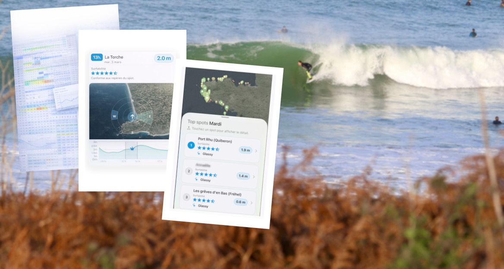
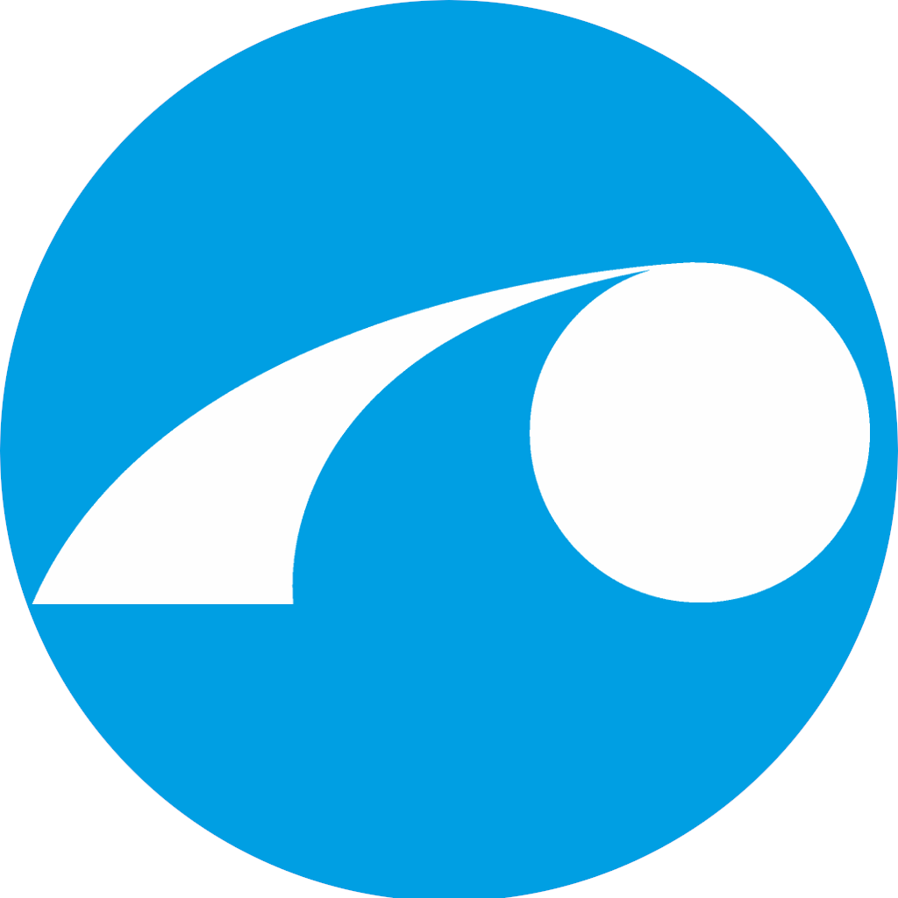
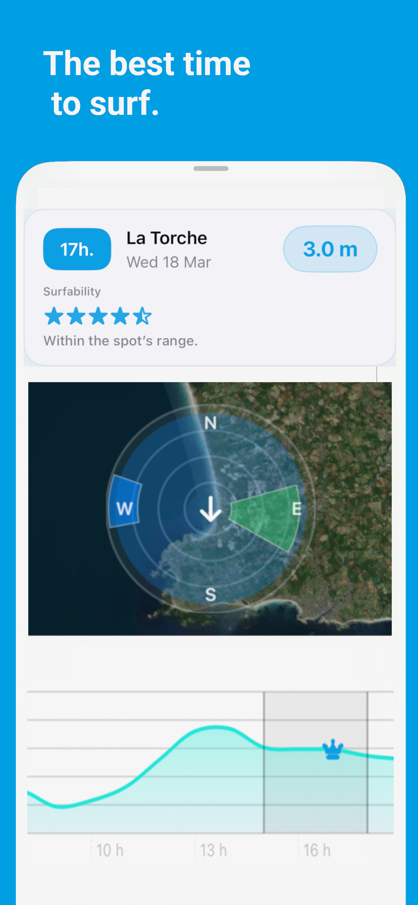
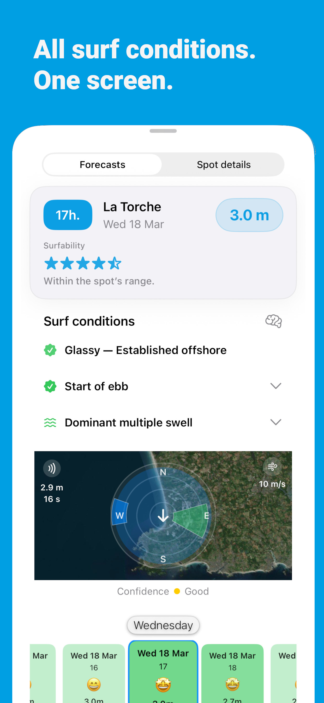
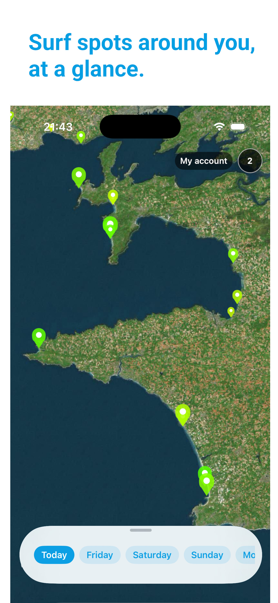
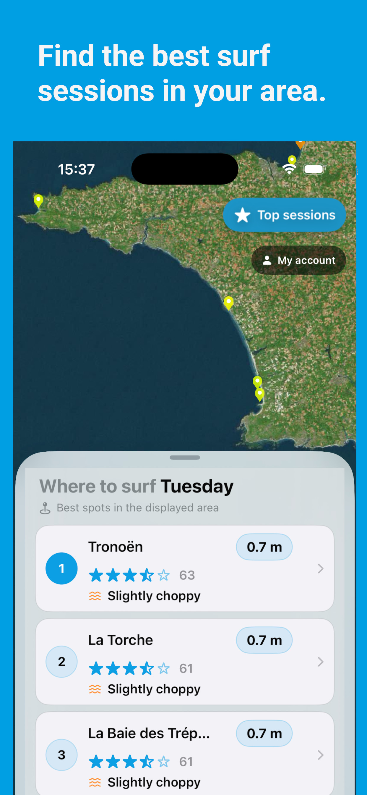
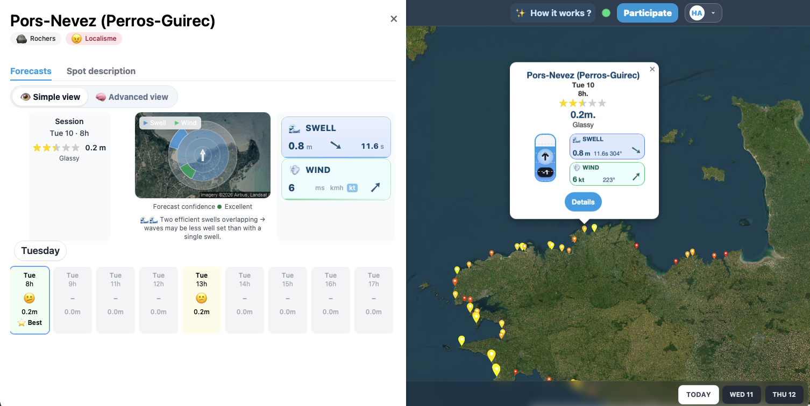

  

  

<h1 align="center">HappySession</h1>

Surf forecasting powered by ocean models, rules engines and machine learning.

<a href="https://happysession.org">🌍 happysession.org</a>

---

# Turning ocean data into surf sessions

HappySession is a platform that transforms **raw oceanographic models into real surf forecasts**.

The project explores how **wave models translate into surf conditions at specific spots**, combining:

- 🌊 NOAA WaveWatch III ocean models  
- 🧠 rule-based surf forecasting  
- 🤖 machine learning spot classifiers  
- ⚙️ microservice backend architecture  
- 📱 native mobile applications  
- 🌐 modern web interface  

---

# 📱 iOS Application

Native SwiftUI application designed to help surfers quickly identify the **best spots and best time to paddle out**.

Features:

- **Stop analyzing.** Start surfing.
- **We tell you when to surf.** One hour. The right one.
- **Everything that matters.** At a glance.
- **Explore and compare.** Stop searching. Choose.

---

# 🌐 Web Application

HappySession is also available on the web.

Explore forecasts and surf spots directly in your browser.

🌍 https://happysession.org

Built with:

- **Nuxt 3**
- Vue
- map visualization
- REST APIs

---

# 🧠 Forecast Engine

The core of HappySession is a **hybrid forecasting engine** combining:

### Rule based forecasting

A **Drools rules engine** interprets wave models and surf spot characteristics.

Rules consider:

- swell direction
- swell period
- tide phase
- wind direction
- wind strength
- spot orientation

### Machine learning models

Some spots use **trained classifiers** to detect good surf conditions.

Example model: happy-model-trestraou

Predicts surf quality at **Trestraou surf spot**.

---

# 🏗 Platform Architecture

HappySession is built as a **modular microservice architecture**.

NOAA WaveWatch III
│
▼
Data extraction
│
▼
Forecast computation
│
▼
API
│
▼
Mobile & Web apps

---

# 🧩 Platform Components

| Service | Description | Tech |
|-------|-------------|------|
| **happy-extractor** | Extracts wave model data from NOAA | Python |
| **happy-api** | Core backend API | Java |
| **happy-rules-engine** | Forecast computation engine | Drools |
| **happy-rules** | Surf forecasting rule set | Drools |
| **happy-mongo** | Forecast data storage | MongoDB |
| **happy-gateway** | API gateway with JWT security | KrakenD |
| **happy-iOS** | Native mobile application | SwiftUI |
| **happy-web** | Web client | Nuxt 3 |
| **happy-model-trestraou** | ML classifier for surf prediction | Python |

---

# 📊 Data Pipeline

The forecasting pipeline runs continuously.

1️⃣ Extract wave model data from NOAA  
2️⃣ Store data in MongoDB  
3️⃣ Compute forecasts every 6 hours  
4️⃣ Expose predictions via REST API  
5️⃣ Deliver forecasts through web and mobile apps

---

# 🎯 Project Goal

HappySession explores new approaches to surf forecasting:

- translating ocean model data into surfable conditions
- combining **rule-based and machine learning prediction**
- building a full **data → backend → mobile platform**

The project aims to better understand how **ocean dynamics translate into real surf sessions**.

---

# 👨‍💻 Author

Created by **Sébastien Durand**

Software engineer and surfer building tools to better understand waves.

🧪 **HappySession is a private platform currently under active development.**